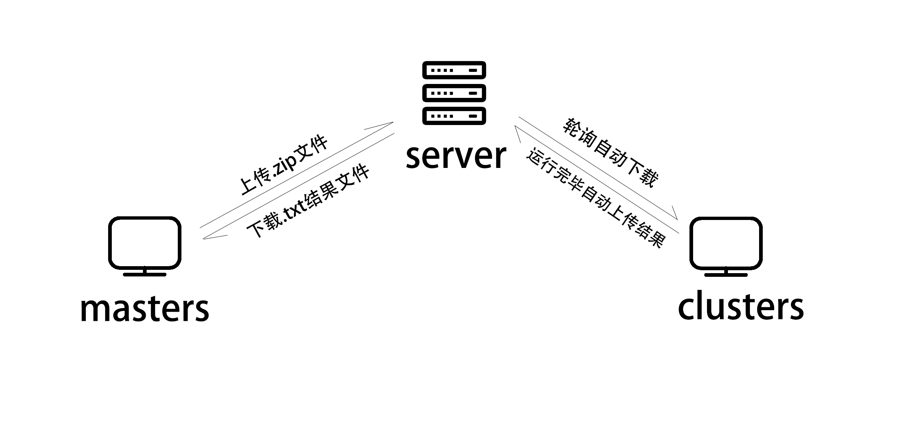

# 边缘计算




## 1. sever.py 文件
这个文件是目标机客户端（clusters）运行的唯一文件，采用定时轮询的方式去访问服务器，获取是否有新的任务需要派发运行，如果有任务则会自动后台运行，不会影响到clusters的使用者（即除了开启这个文件之外不用操作其他和这个程序有关的点击）。想要成功运行，需要在该目录下新建一个文件夹: /documents。  
依赖的外部包有：`requests`

## 2. Bigporeject
分为server端和client端，server即服务器端，client即需要发送文件到其他机器上运行的master，网页方式访问即可。  
server端只需要开启服务器，master只启动client就行了。

## 3.前后端的技术

1. 前端使用 vue 做的简单的界面
```vue
<div id="app">
    <Row>
      <Col span="12" push = '10'>
        <Upload action="/api/upload"
          name = 'myFile'>
          <Button icon="ios-cloud-upload-outline" id = 'upload'>Upload files</Button>
        </Upload>
      </Col>
    </Row>
  </div>
```

2. 后端使用的 express 的 multer 实现上传文件的操作。  
接口：`/upload`
```javascript
router.post('/upload',upload.single('myFile'),(req,res,next)=>{
    if (!req.file){
      res.send("出错了");
      return ;
    }
    console.log(req.file.originalname);
    console.log(req.file.path);
    let oldPath = path.join('../','bin',req.file.path);
    // console.log(oldPath);
    let newPath = path.join('../','bin/uploads',req.file.originalname);
    fs.rename(oldPath,newPath,(err)=>{
        if (err){
        return console.log(err);}
        console.log("修改成功")
    });

    tasklist.push(newPath);
    res.send('兄弟，你的请求成功了')
});
```

3. 后端轮询接口：`/poll`   
clusters使用`http://localhost:3000/api/poll` 去实现对服务器的轮询
```javascript
router.get('/poll', (req, res)=>{
    if(tasklist.length==0){
        console.log(tasklist);
        res.send("notask");
        return;
    }
    var task = tasklist[0].split('\\');
    tasklist.shift();
    res.send(task[task.length-1]);

});
```


4. clusters下载文件的接口`/download`
```javascript
router.get('/download/:file', (req, res)=>{

    var file=req.params.file;
    res.sendFile(file, {root: "D:\\homework\\bigProject\\server\\bin\\uploads\\"}, err => {
});});
```
5. masters 下载.txt的结果文件的接口：`/get`
```javascript
router.get('/get/:file', (req, res)=>{
    res.set("Content-Type", "charset=utf-8");
    var file=req.params.file;
    // res.send("请下载相应的文件")
    console.log(file);
    console.log(result_list);
    if (result_list.indexOf(file)+1) {
        res.sendFile(file, {root: "D:\\homework\\bigProject\\server\\bin\\uploads\\"}, err => {
        });
    }else{
        res.end('please wait ')
    }
});
```

6. `/result` 是clusters上传文件的接口
```javascript
router.post('/result',upload.single("result"),(req,res,next)=>{
    if (!req.file){
        res.send("出错了");
        return ;
    }
    console.log(req.file.originalname);
    console.log(req.file.path);
    let oldPath = path.join('../','bin',req.file.path);
    // console.log(oldPath);
    let newPath = path.join('../','bin/uploads',req.file.originalname);
    fs.rename(oldPath,newPath,(err)=>{
        if (err){
            return console.log(err);}
        console.log("修改成功")
    });
    result_list.push(req.file.originalname);
    res.end()
});
```

### 4. 测试
内部测试：我们组内电脑互联实现跑机器学习代码  
外部测试：拿舍友电脑跑机器学习代码

### 5. `命令`文件夹是我在windows上写的运行脚本